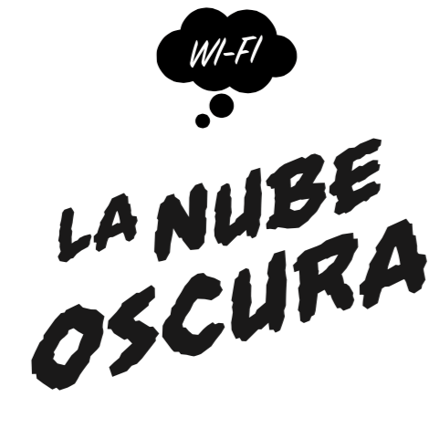
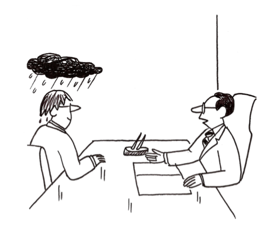
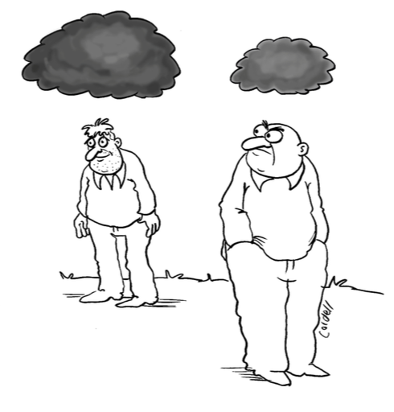
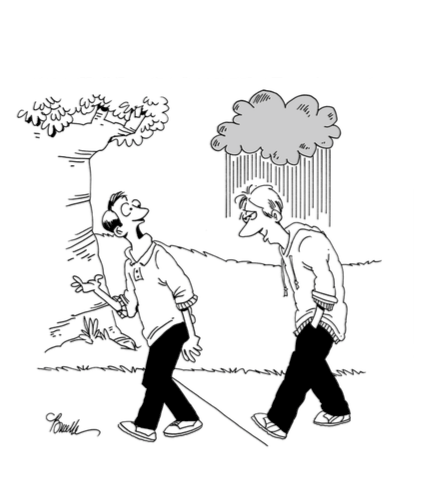

# La Nube Oscura 

Raspberry Pi Ad-hoc Video Exhibition built on [liblib](https://github.com/owise1/liblib) and [liblib-exhib](https://github.com/owise1/liblib-exhib) for the [Kadist Art Foundation](http://kadist.org).

La Nube Oscura is a mobile video program of contemporary artworks, curated (and carried) by Joseph del Pesco. The program is accessed via wifi and viewed on whatever device you have with you: smartphone, laptop or tablet. The contents of the program continue to change and evolve, so log-in to see what's currently on view. Please note that headphones are highly recommended for video viewing. 

There has been some confusion about a variety of new terms recently developed to help us understand parts of the internet that are not findable using search engines like google. These names have appeared because recent estimates suggest these "unfindable areas" account for more than half of the internet's total content. Most of this content is inaccessible by the public for security reasons. These include websites that store -for example- your personal banking information, or retain messages sent to your web-based email account. These websites are accessible only through password, and are now called Deep Web. 

There are other parts of the internet that use sophisticated encryption (such as "Tor", used by Wikileaks and others) which anonymize the location and identity of a given website and its users, and allow for things like the illicit selling and buying of drugs or the leaking of classified information. This zone, called the Dark Web, is only accessible when using the same encryption software as is used by the host website. There's a third zone, called the Dark Internet, which is less understood, and is not accessible through the primary network pathways of the internet. It's either been removed from public access, hacked into invisibility, or contains large amounts of raw data, which are indecipherable by standard internet protocols.

The Cloud is another metaphorical term used to describe how data is stored online-spread out across multiple servers and accessed (by you) using multiple devices. With this project, I'm comparing this virtual cloud to the ethereal and personal one of a wifi signal.

[PDF](assets/NubeOscura_english.pdf)

